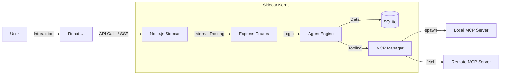

# Workhorse 桌面版深度架构解析

本文档旨在详述 Workhorse 的技术内幕，帮助开发者理解各组件如何在本地协同工作。

## 1. 核心技术栈

- **Runtime**: Node.js 20+ (Sidecar)
- **Desktop Shell**: Tauri 2 (Rust)
- **Frontend**: React 18 + Vite 5 + Ant Design 5
- **Database**: SQLite (`better-sqlite3`)
- **Communication**: HTTP (REST + SSE)

## 2. 进程模型 (Process Model)

Workhorse 启动时会涉及以下进程：

1.  **Main Process (Rust/Tauri)**: 负责窗口管理、系统级集成（菜单、托盘）以及 **Sidecar 进程生命周期管理**。
2.  **Sidecar Process (Node.js)**: 承载整个业务逻辑内核的任务，独立于 UI 运行。
3.  **MCP Worker Processes**: 当调用外部 MCP Server (Stdio) 时，由 Node 进程 fork 出的子进程。

## 3. Node 内核分层职责

### 3.1 Gateway & Auth (Ingress)

- **单机模式鉴权**：在 `server/app.js` 中，系统会通过中间件自动为所有请求注入 `local` 用户上下文，跳过传统登录逻辑。
- **CORS & Proxy**：处理来自前端（通常监听 `12620`）的消息转发至后端（监听 `12621`）。
- **OpenAI 兼容代理**：通过 `/v1/*` 路由提供 OpenAI 兼容接口，支持 `chat/completions`、`models` 等端点，使 Workhorse 可作为其他 AI 工具的模型网关。

### 3.2 Agent Kernel (编排内核)

- **Task Resolver**: 解析 `AgentTask` 配置。
- **Context Management**: 见 `server/utils/contextBudget.js`。系统会自动计算消息和工具 Schema 的 Token 消耗。
- **Compression Logic**: `maybeCompactTaskContext` 函数通过 LLM 总结历史，实现"无限长度"对话的假象。
- **Tool Budget**: 防止工具循环调用，同一工具+参数组合调用超过 100 次时强制总结退出。

### 3.3 Execution Layer (驱动层)

- **MCP Router**: 支持统一的工具调用语法，根据工具名自动分发至对应的 MCP Client。支持 Stdio 和 SSE 两种传输协议。
- **Shell Execution**: 使用 `child_process.spawn` 执行本地命令，并具备超时及手动终止 (AbortSignal) 机制。内置 `shell_execute` 工具提供安全的沙箱执行环境。
- **Built-in Tools**: 除 MCP 工具外，还内置 `shell_execute`（本地命令执行）、`ddg-search`（搜索）等工具。

### 3.4 Observability (可观测性)

- **Run IDs**: 每个 Agent 任务运行都有唯一的 ID，关联所有的 `task_run_events`。
- **Unified Logging**: 使用 `pino` 输出结构化日志，方便在开发终端查错。
- **Usage Tracking**: 记录每次模型调用的 Token 消耗，支持按日期、模型维度统计。

### 3.5 Channel Integration (频道集成)

- **Platform Support**: 支持钉钉等平台的 Webhook 集成。
- **Command Trigger**: 通过外部消息触发对应的 AgentTask 执行。
- **Result Callback**: 任务执行完成后自动推送结果至配置频道。

## 4. 关键设计点

### 4.1 模型调度与容错

Workhorse 支持配置多个 Endpoint 候选。在 `server/models/agentEngine.js` 中，系统会根据健康状况自动在重试时切换 Endpoint。

### 4.2 长任务稳定性

Agent 任务通过异步队列运行。即使前端断开连接，Node Sidecar 依然会继续执行任务，并可选地通过钉钉 Webhook 告知用户最终结果。

## 5. 跨平台注意事项

- **Path Handling**: 始终使用 `path.join` 和 `os.homedir` 以兼容 macOS 和 Windows 的文件路径。
- **Shell Differences**: 在 `mcpManager.js` 中，系统会自动识别并使用 `zsh` (macOS) 或 `cmd.exe` (Windows) 进行命令执行。
